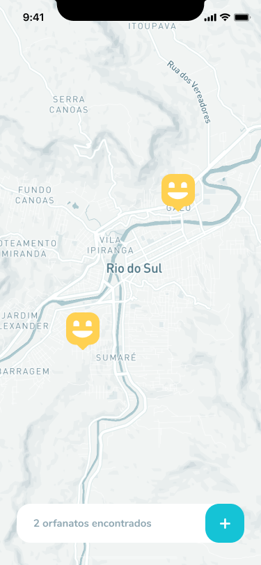

<h1 align="center">Projeto Happy</h1>

 

<h2 align="center">Happy Web</h2>

  

  

 

<h2 align="center">Happy Mobile</h2>

  

## 🚀 Tecnologias

Esse projeto foi desenvolvido com as seguintes tecnologias:

- [Node.js](https://nodejs.org/en/)
- [React](https://reactjs.org)
- [React Native](https://facebook.github.io/react-native/)
- [Expo](https://expo.io/)
- [TypeScript](https://www.typescriptlang.org/)

## 💻 Projeto

O Happy é uma aplicação que conecta pessoas à orfanatos.

Feito Durante a NLW da Rocketseat
